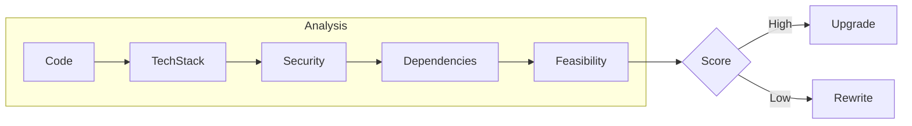
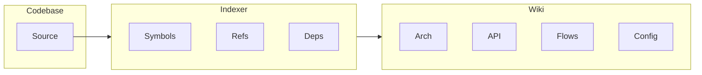
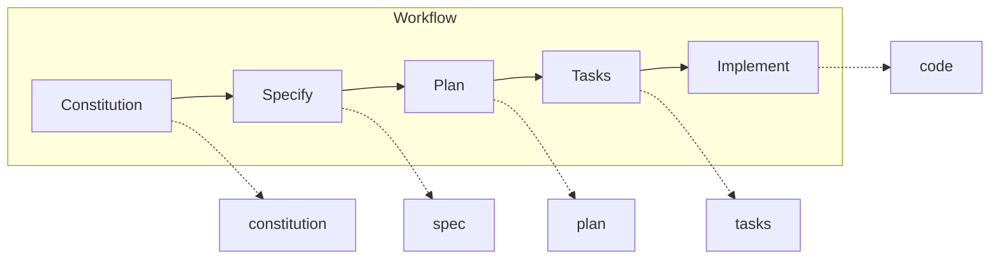
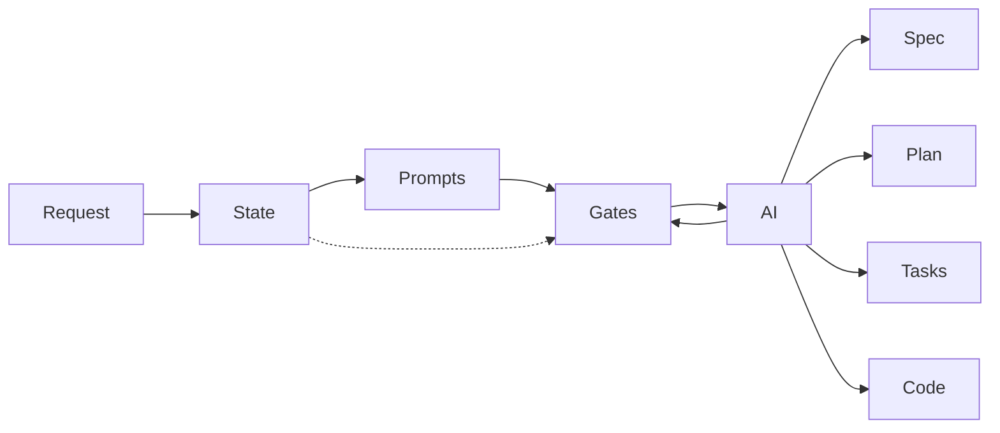
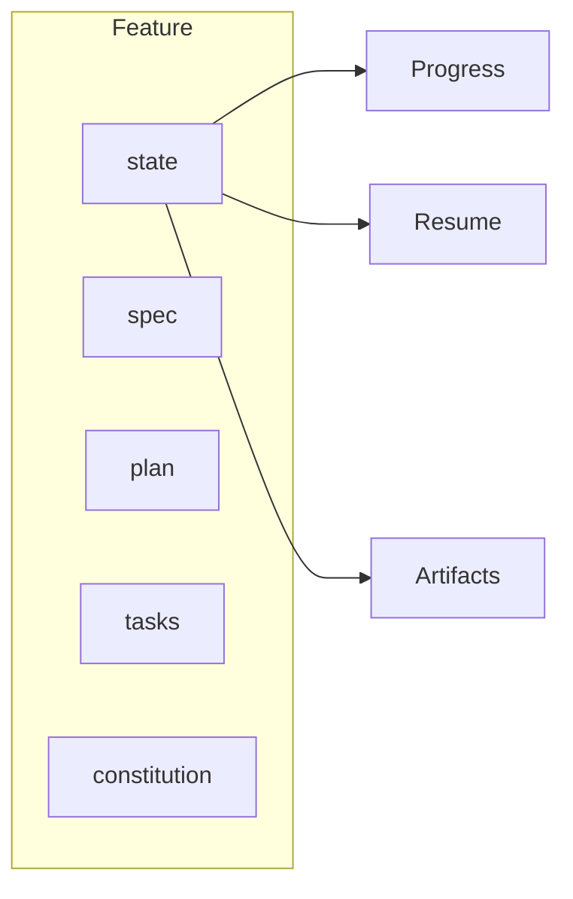

# Civyk Hatch

> **AI-Powered Spec-Driven Development** — Transform how you build software with structured specifications, automated workflows, and intelligent code analysis.

[](https://www.python.org/downloads/)
[](LICENSE)
[](https://modelcontextprotocol.io/)
[](https://pypi.org/project/civyk-hatch/)
[](https://sigstore.dev/)
[](https://slsa.dev)

---

## What is Civyk Hatch Advanced?

Civyk Hatch Advanced is a **command-line toolkit** that brings structure to AI-assisted software development. Instead of ad-hoc prompting, it guides AI coding agents through a **spec-driven workflow**: define requirements → plan architecture → generate tasks → implement code.

**The Problem:** AI coding agents are powerful but unpredictable. Without structure, they produce inconsistent results, skip edge cases, and lack traceability from requirements to code.

**The Solution:** Civyk Hatch Advanced provides:

- **Structured workflows** that break complex features into manageable, traceable steps
- **Embedded prompts** that guide AI agents with RFC 2119 compliance (MUST/SHOULD/MAY)
- **State management** that survives context limits and enables workflow resumption
- **Quality gates** with automated review and test coverage enforcement

---

## Key Features

| Feature | Description |
|---------|-------------|
| **Orchestrator** | Single-command workflow: constitution → spec → plan → tasks → implement |
| **Auto-Resume** | Resume after AI context limits with zero progress loss |
| **Reverse Engineering** | Analyze legacy codebases, assess tech debt, generate modernization plans |
| **DeepWiki** | Generate comprehensive AI-powered wiki documentation for any codebase |
| **Corporate Guidelines** | Extract standards from PDFs and reference projects (RFC 2119) |
| **Quality Workflows** | Iterative `/tests` and `/review` until quality gates pass |
| **Cross-Platform** | Works on Linux, macOS, and Windows |
| **12+ AI Agents** | Claude Code, GitHub Copilot, Cursor, Gemini CLI, and more |

---

## Quick Start

### Installation

```bash
# Recommended: Install with pipx (isolated environment)
pipx install civyk-hatch

# Alternative: Install with pip
pip install civyk-hatch
```

### Initialize Project

```bash
# CLI mode (slash commands - default)
civyk-hatch init my-project --ai claude --mode cli

# MCP mode (JSON-RPC server)
civyk-hatch init my-project --ai claude --mode mcp

# Interactive (prompts for mode)
civyk-hatch init my-project --ai claude

# Verify installation
civyk-hatch check
```

**CLI mode** creates:

- `AGENTS.md` — AI agent instructions
- `.claude/commands/` — Slash command definitions (for Claude Code)
- `memory/` — Workflow state persistence

**MCP mode** creates:

- `.mcp.json` — MCP server configuration (or agent-specific path)
- `CLAUDE.md` — Instruction file with MCP tool guidance
- `memory/` — Workflow state persistence

### Build Your First Feature

In your AI coding agent (Claude Code, Cursor, etc.):

```bash
# Option 1: Full automated workflow
/civyk-hatch.orchestrate Build a user authentication system with OAuth2

# Option 2: Step-by-step (learning mode)
/civyk-hatch.constitution   # Define project principles
/civyk-hatch.specify        # Create requirements spec
/civyk-hatch.plan           # Design architecture
/civyk-hatch.tasks          # Generate task breakdown
/civyk-hatch.implement      # Execute implementation
```

---

## Core Workflows

### Feature Development (Greenfield)

```bash
/civyk-hatch.orchestrate <feature description>
```

Runs the complete workflow automatically. Use `/civyk-hatch.resume` after context resets.

### Legacy Modernization (Reverse Engineering)

```bash
/civyk-hatch.analyze-project
```



Analyzes existing codebases with:
- Tech stack detection & EOL tracking
- Security vulnerability scanning
- Dependency health analysis
- Feasibility scores (0-100) for upgrade vs. rewrite
- Migration strategy recommendations

### Documentation Generation (DeepWiki)

```bash
/civyk-hatch.deepwiki
```



Generates comprehensive wiki from code:
- Architecture diagrams
- API documentation
- Data flow documentation
- Component breakdowns
- Configuration guides

Requires [civyk-repoix](https://github.com/civyk-official/civyk-repoix) MCP server for codebase indexing.

### Quality Enforcement

```bash
/civyk-hatch.tests    # Iterate until coverage target met
/civyk-hatch.review   # Iterate until no Critical/High/Medium findings
```

These work on **any branch** — with or without the full spec workflow.

---

## All Commands

### Workflow Commands

| Command | Description |
|---------|-------------|
| `orchestrate` | Run complete spec-driven workflow |
| `resume` | Resume interrupted workflow |
| `constitution` | Define project principles |
| `specify` | Create requirements specification |
| `clarify` | Resolve requirement ambiguities |
| `plan` | Create technical architecture |
| `tasks` | Generate implementation tasks |
| `implement` | Execute task implementation |
| `analyze` | Cross-artifact consistency check |
| `tests` | Iterative test coverage |
| `review` | Iterative code review |
| `checklist` | Generate quality checklist |
| `sync-docs` | Sync documentation with codebase |
| `understand` | Build codebase understanding cache |
| `rapid` | Streamlined workflow for small changes (<300 LOC) |

### Analysis Commands

| Command | Description |
|---------|-------------|
| `analyze-project` | Legacy codebase analysis & modernization planning |
| `deepwiki` | Generate AI-powered documentation |
| `generate-guidelines` | Extract corporate standards |
| `verify-report` | Validate analysis quality gates |

### Discovery Commands (civyk-repoix)

| Command | Description |
|---------|-------------|
| `repoix-scan` | Initial codebase discovery |
| `category-scan` | Architectural pattern detection |
| `category-patterns` | Discover naming conventions from symbols |
| `deep-dive-scan` | Symbol-level analysis |
| `config-scan` | Configuration file analysis |
| `test-scan` | Test coverage analysis |
| `quality-scan` | Code quality metrics |

### Enterprise Commands

| Command | Description |
|---------|-------------|
| `check-artifactory` | Check library availability in Artifactory |
| `search-lib` | Search configured Artifactory (uses `memory/config.json`) |

### Utility Commands

| Command | Description |
|---------|-------------|
| `init` | Initialize new project |
| `check` | Verify tool installation |
| `create-feature` | Create feature branch & directory |
| `setup-plan` | Set up plan file from template |
| `update-agent-context` | Update agent context files with plan info |
| `enumerate-project` | Generate file manifest for AI analysis |
| `list-files` | List files matching pattern and category |
| `file-stats` | Get file statistics (lines, size, patterns) |
| `mcp` | Start MCP server for AI agent integration |

### Internal Commands

Used by MCP server and workflows — not typically invoked directly.

| Command | Description |
|---------|-------------|
| `write-data` | Write JSON artifact to `data/` folder |
| `write-report` | Write Markdown report to `reports/` folder |
| `update-stage` | Update workflow stage status in `state.json` |
| `update-preferences` | Update modernization preferences |
| `get-context` | Get context variables for prompt rendering |
| `deepwiki-update-state` | Manage deepwiki generation state |

Run `civyk-hatch --help` for complete command reference.

---

## Supported AI Agents

| Agent | Status | Notes |
|-------|--------|-------|
| [Claude Code](https://www.anthropic.com/claude-code) | ✅ | Full support |
| [GitHub Copilot](https://code.visualstudio.com/) | ✅ | Full support |
| [Cursor](https://cursor.sh/) | ✅ | Full support |
| [Gemini CLI](https://github.com/google-gemini/gemini-cli) | ✅ | Full support |
| [Windsurf](https://windsurf.com/) | ✅ | Full support |
| [Qwen Code](https://github.com/QwenLM/qwen-code) | ✅ | Full support |
| [opencode](https://opencode.ai/) | ✅ | Full support |
| [Codex CLI](https://github.com/openai/codex) | ✅ | Full support |
| [Roo Code](https://roocode.com/) | ✅ | Full support |
| [Kilo Code](https://github.com/Kilo-Org/kilocode) | ✅ | Full support |
| [Amazon Q Developer CLI](https://aws.amazon.com/developer/learning/q-developer-cli/) | ⚠️ | No custom args |

Use `--ai <agent>` during init: `claude`, `copilot`, `cursor-agent`, `gemini`, `windsurf`, `qwen`, `opencode`, `codex`, `roo`, `kilocode`, `auggie`, `codebuddy`, `amp`, `q`

---

## Prerequisites

- **Python 3.10+** — [Download](https://www.python.org/downloads/)
- **Git** — [Download](https://git-scm.com/downloads)
- **AI Coding Agent** — Any from the [supported list](#supported-ai-agents)
- **civyk-repoix** (optional) — Required for DeepWiki and discovery commands

---

## Documentation

Run `civyk-hatch --help` for the complete command reference. Detailed documentation is included in the installed package.

---

## How It Works

### Spec-Driven Development Flow



Each stage produces artifacts that feed the next, creating full traceability from requirements to implementation.

### Workflow Architecture



### State Management



State enables:
- **Resume after interruption** — Pick up exactly where you left off
- **Progress tracking** — Know what's done and what's pending
- **Artifact validation** — Ensure each stage produces required outputs

---

## Enterprise Features

### Corporate Guidelines Integration

```bash
/civyk-hatch.generate-guidelines /path/to/corporate-resources
```

Extracts standards from:
- Corporate policy PDFs
- Reference implementation projects
- Compliance documentation

Generates RFC 2119 guidelines (MUST/SHOULD/MAY) in `.guidelines/`.

### Artifactory Integration

Configure in `memory/config.json`:

```json
{
  "artifactory": {
    "enabled": true,
    "url": "https://artifactory.company.com/artifactory",
    "repos": "pypi-remote,npm-remote",
    "apiKeyEnv": "ARTIFACTORY_API_KEY"
  }
}
```

### Analysis Scopes

| Scope | Use Case |
|-------|----------|
| **Full Application (A)** | Complete modernization with specs & migration plan |
| **Cross-Cutting (B)** | Targeted migration (auth, DB, caching, etc.) |

---

## Contributing

Contributions are welcome! Please:

1. Fork the repository
2. Create a feature branch (`git checkout -b feature/amazing-feature`)
3. Commit changes (`git commit -m 'Add amazing feature'`)
4. Push to branch (`git push origin feature/amazing-feature`)
5. Open a Pull Request

See [AGENTS.md](AGENTS.md) for code style and AI agent interaction guidelines.

---

## Glossary

| Term | Definition |
|------|------------|
| **Constitution** | Project principles governing AI decisions |
| **Orchestrator** | Single-command workflow manager |
| **Cross-Cutting Concern** | Architectural aspect affecting multiple modules |
| **Feasibility Score** | 0-100 rating for upgrade viability |
| **Stage Prompts** | Pre-generated prompts for workflow phases |
| **Blast Radius** | % of codebase affected by a change |

---

## Support

**Help keep this project alive and growing!**

If Civyk Hatch has helped your development workflow, consider supporting its continued development. Your contribution helps with:

- Ongoing maintenance and bug fixes
- New feature development
- Infrastructure costs

**50% of all donations go directly to children's charities** helping those in need. The remaining funds support project maintenance and feature upgrades.

[](https://buymeacoffee.com/civyk)
[](https://ko-fi.com/civyk)

> Every contribution, no matter the size, makes a difference.

---

## License

Proprietary — see [LICENSE](LICENSE) for details.

---

## Maintainers

**Veerabhadra Rao Ponna** ([@veerabhadra-ponna](https://github.com/veerabhadra-ponna))

---

*Built on Trust, Driven by Value*
